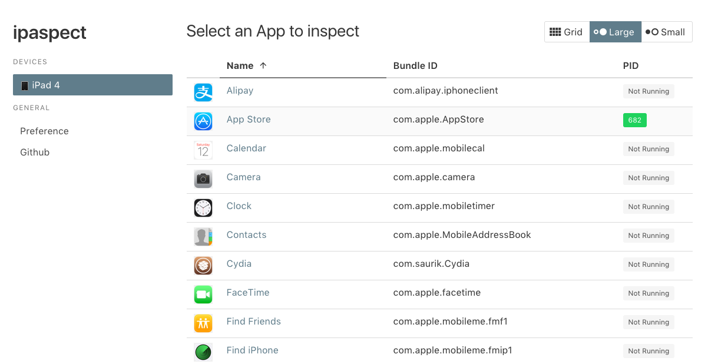

# ipaspect

simple IPA inspect tool

NOTE: This project is just for fun, the author has no guarantee for its accuracy.

## Setup

Requirements: latest [node.js](https://nodejs.org/) and [yarn](https://yarnpkg.com/)

### Building agent.dylib

```shell
git submodule init
cd agent/dylib/LIEF
cmake . -DCMAKE_TOOLCHAIN_FILE=../ios-cmake/ios.toolchain.cmake -DIOS_PLATFORM=OS -DLIEF_PYTHON_API=off -DCMAKE_BUILD_TYPE=Release
```

### Server Side

```shell
yarn
npm run dev
```

### GUI

```shell
cd gui
yarn
npm run dev
```

Not open localhost:8080 in browser.



## LICENCE

MIT
