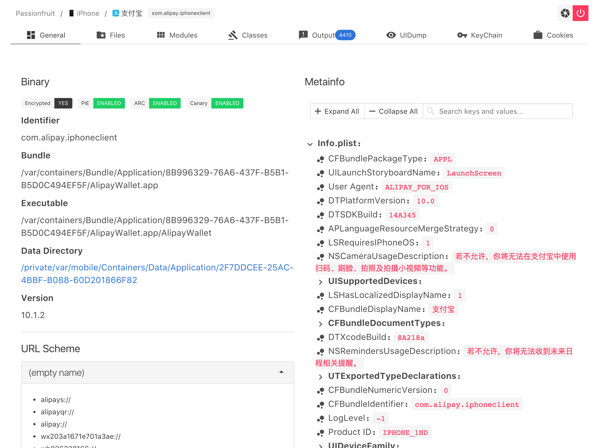
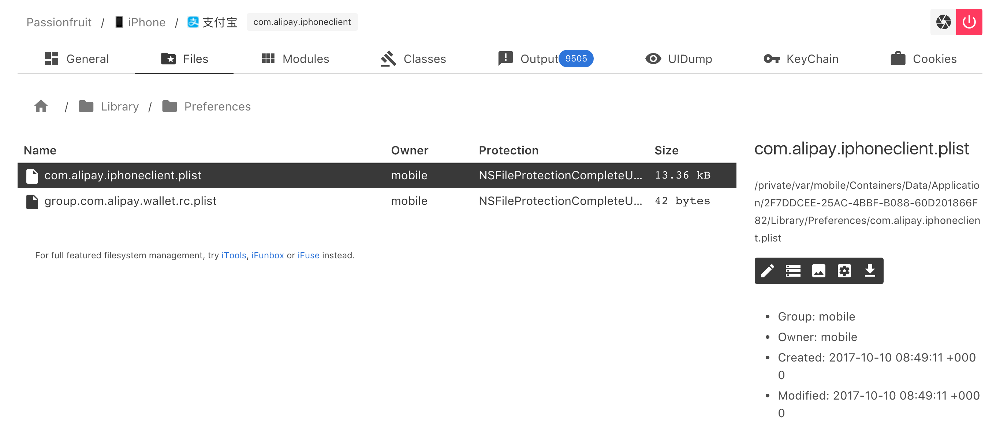
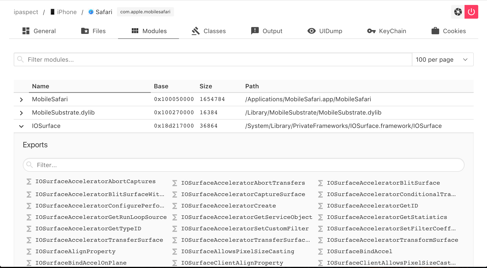
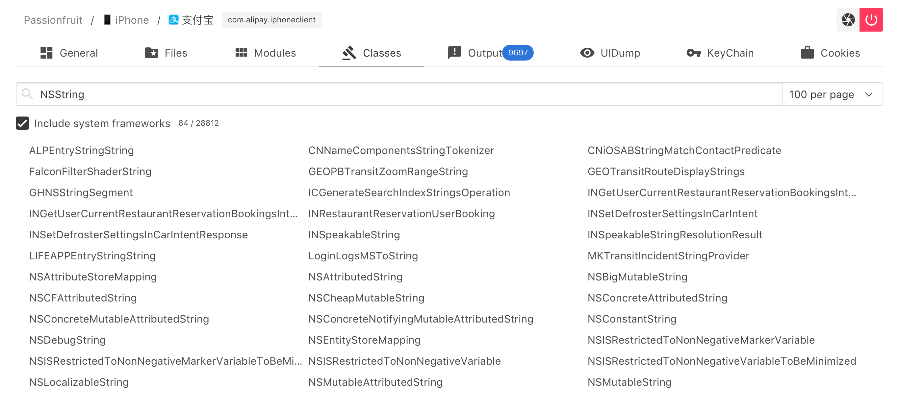
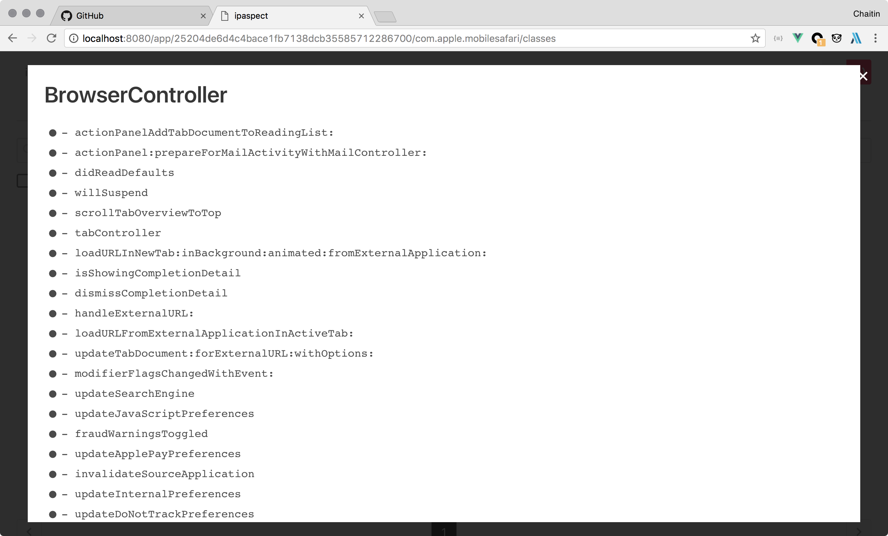
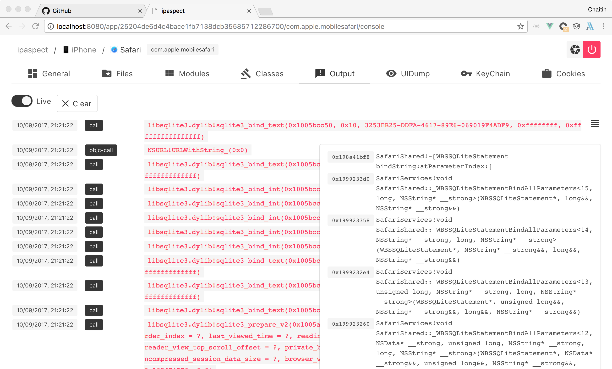
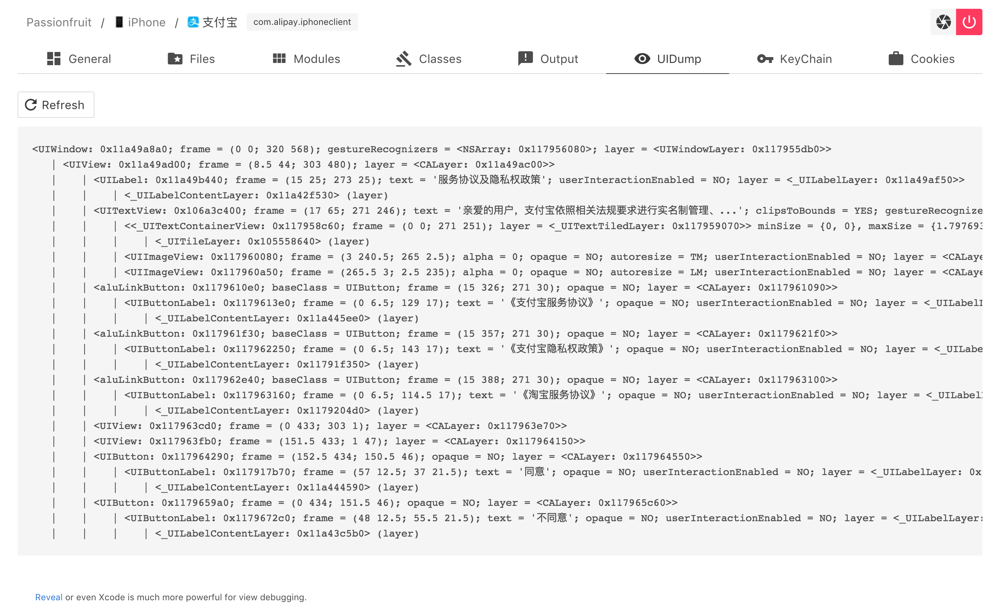

# Passionfruit

Simple iOS app blackbox assessment tool. Powered by [frida.re](https://www.frida.re) and [vuejs](https://www.vuejs.org).

## Features

* **Fully web based GUI!**
* Also supports non-jailbroken device.
* List all url schemes.
* List human readable app meta info (Info.plist).
* Capture screenshot.
* Checksec: see if target app is encrypted, and has enabled PIE, ARC and stack canary.
* App sandbox file browser. Directly preview images, SQLite databases and plist files on device. You can always download the file for further investigation.
* Check the loaded frameworks. Hook exported native functions from these dylib to print the arguments and stack trace.
* Log SQLite operations.
* Log and try to bypass jailbreak detection.
* List Objective-C classes from app, hook the methods and inspect the arguments and stack trace.
* Read keychain items.
* Read cookies.
* Read UserDefaults.
* Simple ui dump.

## Screenshots



Checksec, url schemes and metainfo.



File browser with hex viewer, image viewer, plist viewer and SQLite database reader.



Loaded frameworks and their exported symbols.





Objective C classes and methods.



Intercepted calls, arguments and stack trace.



Dump ui description of the key window.


KeyChain reader.

## Setup

Requirements:

* Latest [node.js](https://nodejs.org/) (>=7.10.1) and [yarn](https://yarnpkg.com/) (or [npm](https://www.npmjs.com) if you prefer) to run the api server and web gui
* Any modern desktop browser you like

### Jailbroken Device

See https://www.frida.re/docs/ios/

> Start `Cydia` and add Frida’s repository by going to `Manage` -> `Sources` -> `Edit` -> `Add` and enter `https://build.frida.re`. You should now be able to find and install the `Frida` package which lets Frida inject JavaScript into apps running on your iOS device. This happens over USB, so you will need to have your USB cable handy, though there’s no need to plug it in just yet.

### Non-jailbroken Device

Official documentation of frida.re (linked above) also introduces how to inject [FridaGadget.dylib](https://build.frida.re/frida/ios/lib/FridaGadget.dylib) to the ipa, requires repack and resign.

Here are some articles about how to do so:

* [MonkeyDev/wiki/非越狱App集成#集成frida](https://github.com/AloneMonkey/MonkeyDev/wiki/%E9%9D%9E%E8%B6%8A%E7%8B%B1App%E9%9B%86%E6%88%90#集成frida)（Chinese)
* https://www.nccgroup.trust/uk/about-us/newsroom-and-events/blogs/2016/october/ios-instrumentation-without-jailbreak/

### Starting the WebUI

This is the easiest way to start if you don't want to modify the project.

* Open the terminal and `cd` into the project directory.
* If it is the first time you cloned this project, you need to install npm dependencies and build the frontend. Run `npm install` or `yarn` for the node.js requirements on the first time. Then `npm run build` (or `yarn run build`) to build the bundle.
* Then use `npm start` or `yarn start`
* Open `http://localhost:31337` in your browser. If the port 31337 is in use, set environment variable `PORT` to use an alternative port. Also, setting `HOST` can force to listen on an alternative interface, but be careful because it has no authentication yet: `HOST=192.168.1.100 PORT=12345 npm start`

### Development (optional)

For those who wants to contribute, you may probably need to restart the api server and reload webpage each time you make a change. The following steps enable livereload.

#### API server

```shell
yarn
npm run dev
```

#### Webpack server

```shell
cd gui
yarn
npm run dev
```

#### Frida script compiler

Frida agent needs to be compiled at the first time: `npm run build`

If you need livereload like webpack, use `npm run watch`.


Now open localhost:8080 in browser.

## FAQ

### Why `npm start` is complaining about syntax error?

This project uses the lastest ECMAScript feature in server side. You need nodejs v7.10.1 at least, but v8.x and above is recommended. I've got some users reporting that yarn is not compatible with lower nodejs version.

### "Device is not an iOS device, or you have not installed frida on it"

Make sure you have frida.re successfully installed. See the links above. Also, check if the version on of frida on device matches.

### Have problem with `npm install/build`?

Users from China mainland may encounter network problem. Try npm mirrors like [cnpm](https://npm.taobao.org/).

Besides, after updating source with `git pull`, or having nodejs engine upgraded, you may need to remove `node_modules` directory and re-run `npm install ; npm run build`.

## LICENCE

MIT
