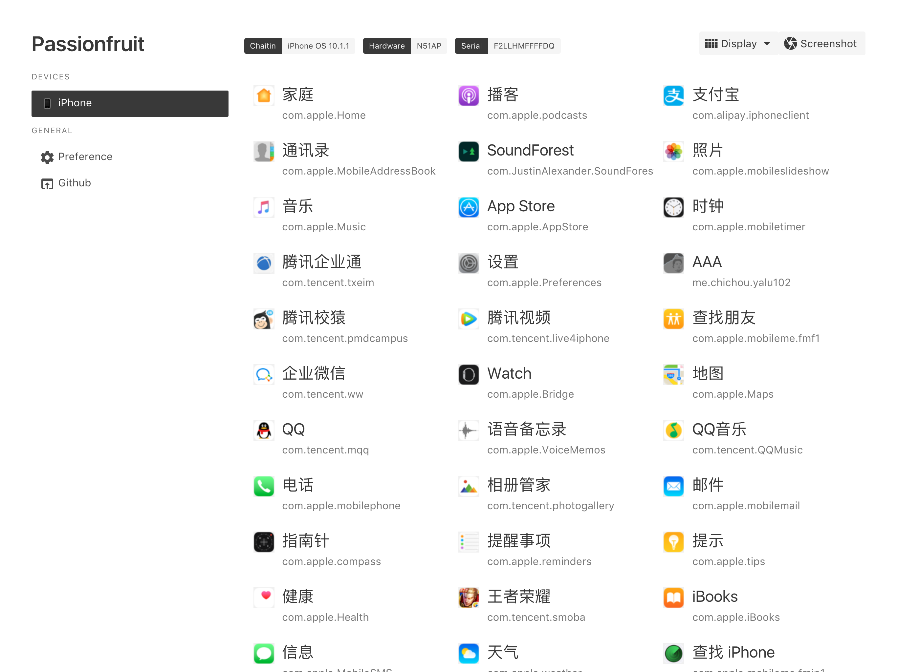
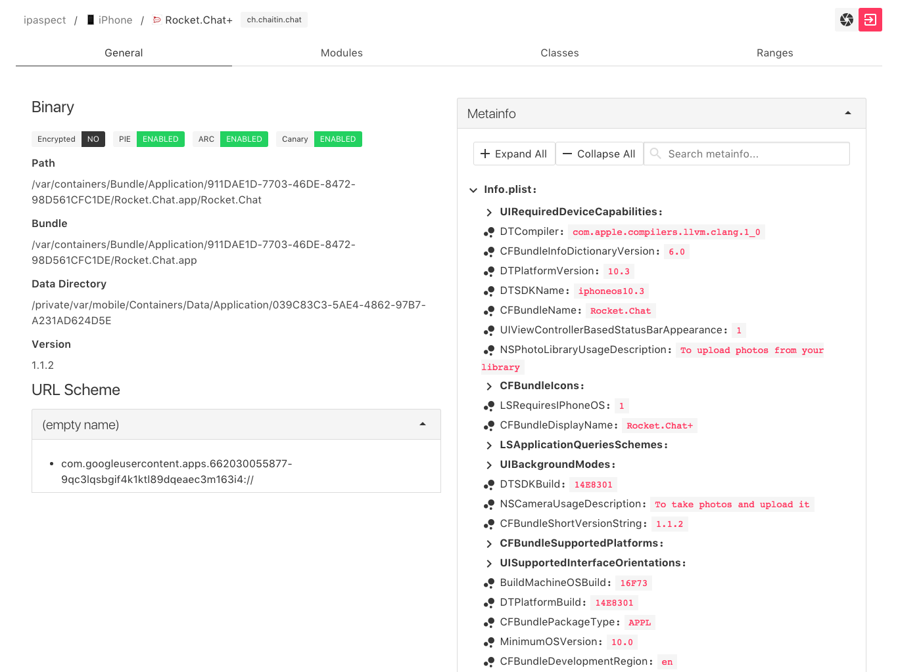

# ipaspect

simple IPA inspect tool






## Setup

Requirements: latest [node.js](https://nodejs.org/) and [yarn](https://yarnpkg.com/), [theos](https://github.com/theos/theos)

### Building agent tweak

Make sure you have theos installed, see [theos installation](https://github.com/theos/theos/wiki/Installation)

```shell
cd agent
make package
```

Deploy generated `.deb` to your jailbroken iOS device.

### Server Side

```shell
yarn
npm run dev
```

### GUI

```shell
cd gui
yarn
npm run dev
```

Now open localhost:8080 in browser.

## LICENCE

MIT
