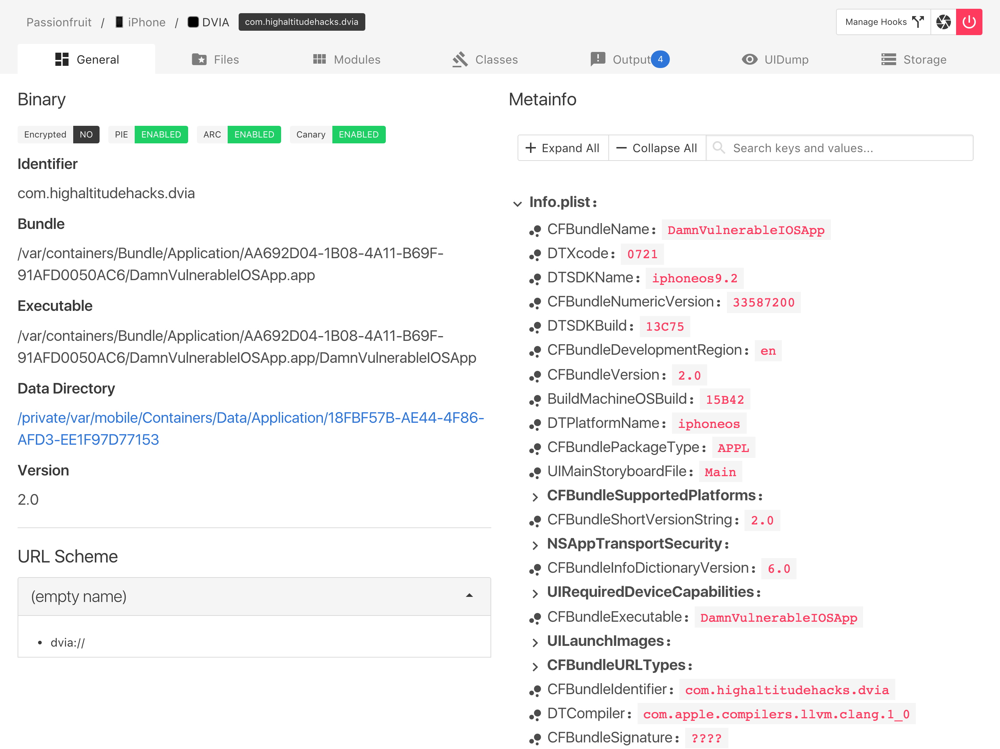

**Discontinued Project**

This project has been discontinued. Please use the new [Grapefruit](https://github.com/chichou/grapefruit)

https://github.com/chaitin/passionfruit/issues/74

## frida@14 compatibility issues

frida@14 introduces lots of breaking changes. After struggling a bit, I was unable to solve them. If you still need passionfruit, please keep the frida on your device to stay at 12.x.

----


[](https://badge.fury.io/js/passionfruit)
[](https://opensource.org/licenses/MIT)

Simple iOS app blackbox assessment tool. Powered by [frida.re](https://www.frida.re) and [vuejs](https://www.vuejs.org).

## TL;DR

```shell
npm install -g passionfruit
passionfruit
```

## Features

* **Cross plarform web GUI!**
* Also supports non-jailbroken device (see [Non-jailbroken device](#non-jailbroken-device)).
* List all url schemes.
* Check signature entitlements.
* List human readable app meta info (Info.plist).
* Capture screenshot.
* Checksec: see if target app is encrypted, and has enabled PIE, ARC and stack canary.
* App sandbox file browser. Directly preview images, SQLite databases and plist files on device. You can always download the file for further investigation.
* Check the loaded frameworks. Hook exported native functions from these dylib to print the arguments and stack trace.
* Log SQLite operations.
* Log and try to bypass jailbreak detection.
* List Objective-C classes from app, hook the methods and inspect the arguments and stack trace.
* Dump KeyChain, BinaryCookies and UserDefaults.



Please check out Wiki for more information.

* [Screenshots](https://github.com/chaitin/passionfruit/wiki/Screenshots)
* [FAQ](https://github.com/chaitin/passionfruit/wiki/FAQ)

## Setup

### Desktop requirements:

* [node.js](https://nodejs.org/) **LTS** and [npm](https://www.npmjs.com) to run the api server and web gui
* Any modern desktop browser you like

Passionfruit is now avaliable on npm, so just type following command to install:

```shell
npm install -g passionfruit
```

Then launch it:

```shell
passionfruit
```

Note that if the port 31337 is in use, set environment variable `PORT` to use an alternative port. Also, setting `HOST` can force to listen on an alternative interface, but be careful because it has no authentication yet:

```
HOST=192.168.1.100 PORT=12345 passionfruit
```

**Security Warning**

Passionfruit does not support authentication now, so any one that have access to the web page may control your connected devices!

### Device setup:

#### Jailbroken Device

See https://www.frida.re/docs/ios/

> Start `Cydia` and add Frida’s repository by going to `Manage` -> `Sources` -> `Edit` -> `Add` and enter `https://build.frida.re`. You should now be able to find and install the `Frida` package which lets Frida inject JavaScript into apps running on your iOS device. This happens over USB, so you will need to have your USB cable handy, though there’s no need to plug it in just yet.

#### Non-jailbroken Device

Official documentation of frida.re (linked above) also introduces how to inject [FridaGadget.dylib](https://build.frida.re/frida/ios/lib/FridaGadget.dylib) to the ipa, requires repack and resign.

Here are some articles about how to do so:

* [MonkeyDev/wiki/非越狱App集成#集成frida](https://github.com/AloneMonkey/MonkeyDev/wiki/%E9%9D%9E%E8%B6%8A%E7%8B%B1App%E9%9B%86%E6%88%90#集成frida)（Chinese)
* https://github.com/tanprathan/Fridpa
* https://www.nccgroup.trust/uk/about-us/newsroom-and-events/blogs/2016/october/ios-instrumentation-without-jailbreak/

## Development setup

Clone this project and install requirements:

```shell
git clone https://github.com/chaitin/passionfruit.git
npm install
```

For those who wants to contribute, you may probably need to restart the api server and reload webpage each time you make a change. The following steps enable livereload.

```shell
npm run dev
```

Browser will be open (http://localhost:8080)

## LICENCE

MIT
